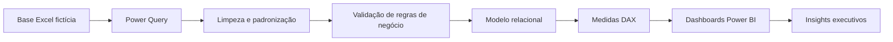
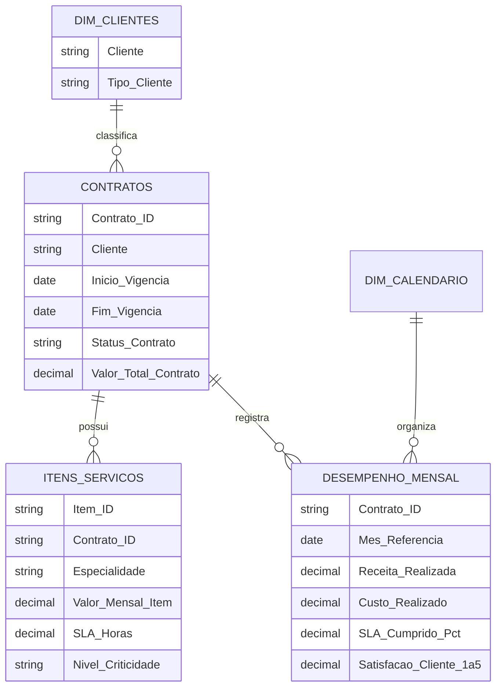

# Projeto 01 | Análise Estratégica de Contratos e Performance

Projeto de **Business Intelligence em Power BI** desenvolvido com dados 100% fictícios para simular um cenário real de gestão de contratos, acompanhamento financeiro, performance operacional e qualidade dos dados em uma empresa de serviços de saúde.

> **Objetivo do portfólio:** demonstrar domínio de Power Query, modelagem de dados, DAX, construção de KPIs, análise de negócio, Data Quality e storytelling com dados.

---

## Visão geral em 30 segundos

| Indicador | Resultado |
|---|---:|
| Contratos analisados | **80** |
| Itens/serviços analisados | **246** |
| Registros mensais de performance | **855** |
| Receita total | **R$ 348,4 Mi** |
| Margem total | **R$ 59,7 Mi** |
| Margem média | **17,1%** |
| Atingimento da meta de receita | **97,7%** |
| Valor contratado total | **R$ 652 Mi** |
| Valor exposto a vencimentos em 120 dias | **R$ 79,51 Mi** |
| Taxa final de validação dos dados | **100%** |

---

## Navegação do projeto

- [Contexto e objetivo](#contexto-e-objetivo)
- [Perguntas de negócio](#perguntas-de-negócio)
- [Fluxo do projeto](#fluxo-do-projeto)
- [Modelo de dados](#modelo-de-dados)
- [Dashboards](#dashboards)
- [Data Quality](#data-quality)
- [Principais insights](#principais-insights)
- [Tecnologias e competências](#tecnologias-e-competências)
- [Estrutura do repositório](#estrutura-do-repositório)
- [Como explorar o projeto](#como-explorar-o-projeto)
- [Documentação técnica](#documentação-técnica)

---

## Contexto e objetivo

O cenário simula uma empresa que possui dezenas de contratos de prestação de serviços, diferentes especialidades, clientes públicos e privados e indicadores mensais de operação.

O desafio foi transformar dados brutos em uma solução analítica capaz de apoiar decisões sobre:

- receita, custos e rentabilidade;
- concentração de clientes;
- contratos ativos, encerrados e próximos do vencimento;
- especialidades e serviços de maior impacto;
- SLA, satisfação, absenteísmo e incidentes;
- confiabilidade e qualidade dos dados utilizados nas análises.

Todos os nomes, clientes, valores e demais informações são **fictícios** e foram criados exclusivamente para estudo e portfólio.

---

## Perguntas de negócio

A solução foi construída para responder perguntas como:

1. Qual é o tamanho e o valor da carteira de contratos?
2. Quais clientes concentram maior receita e margem?
3. Quais contratos exigem atenção por proximidade do vencimento?
4. Quanto do valor da carteira está exposto nos próximos 120 dias?
5. Quais especialidades têm maior valor mensal, volume e criticidade?
6. A operação está atingindo suas metas de receita?
7. Como evoluem SLA, satisfação, absenteísmo e incidentes?
8. Os dados utilizados nas análises são consistentes e confiáveis?

---

## Fluxo do projeto



### Etapas realizadas

**1. Ingestão**  
Importação das tabelas de contratos, itens/serviços, desempenho mensal e clientes.

**2. Tratamento no Power Query**  
Remoção de duplicidades, padronização de textos, correção de tipos, recuperação de valores ausentes e criação de regras de validação.

**3. Modelagem**  
Criação das dimensões de clientes e calendário e relacionamentos 1:N entre contratos, serviços e desempenho.

**4. DAX**  
Construção de indicadores financeiros, contratuais, operacionais e de qualidade.

**5. Visualização**  
Desenvolvimento de cinco páginas com objetivos diferentes e complementares.

---

## Modelo de dados

O modelo segue uma estrutura simples de fatos e dimensões:



Mais detalhes em [Arquitetura do Modelo](documentacao/arquitetura_modelo.md) e [Dicionário de Dados](documentacao/dicionario_dados.md).

---

# Dashboards

## 1. Visão Executiva

Resumo da carteira com foco em resultado financeiro, concentração, rentabilidade e evolução de receita.


### Principais KPIs

- Receita total: **R$ 348,4 Mi**
- Custo total: **R$ 288,7 Mi**
- Margem total: **R$ 59,7 Mi**
- Margem: **17,1%**
- Quantidade de contratos: **80**
- Ticket médio por contrato: **R$ 8,2 Mi**
- Atingimento da meta: **97,7%**
- Concentração de receita Top 3 clientes: **38,3%**

### O que essa página responde

- Quem são os clientes de maior receita?
- Em quais UFs a operação está mais concentrada?
- Quais especialidades geram maior receita?
- Como receita e rentabilidade se relacionam?
- Como a receita realizada evolui em relação à meta?

---

## 2. Análise de Contratos

Página dedicada ao risco contratual, vencimentos e exposição financeira.


### Principais KPIs

- Contratos ativos: **36**
- Contratos vencendo: **8**
- Contratos encerrados: **36**
- Valor contratado total: **R$ 652 Mi**
- Valor exposto em 120 dias: **R$ 79,51 Mi**
- Percentual do valor exposto: **12,2%**

### Priorização dos vencimentos

Os contratos foram classificados em:

| Faixa | Regra |
|---|---|
| **Urgente** | até 30 dias |
| **Atenção** | 31 a 60 dias |
| **Monitorar** | 61 a 120 dias |

A tabela de contratos críticos permite ordenar a carteira pela urgência e pelo impacto financeiro.

---

## 3. Especialidades e Serviços

Análise da operação em nível de serviço, considerando volume, valor mensal, SLA e criticidade.


### Principais KPIs

- Serviços: **246**
- Especialidades: **12**
- Valor mensal de serviços: **R$ 36,12 Mi**
- Ticket médio por serviço: **R$ 146,84 mil**
- Serviços de alta criticidade: **86**
- SLA médio: **10,47 horas**

### Objetivo analítico

A combinação entre **valor mensal** e **criticidade** ajuda a identificar especialidades que exigem maior atenção operacional e financeira.

---

## 4. Performance e Qualidade

Monitoramento dos principais indicadores operacionais ao longo do tempo.


### Principais KPIs

- Margem: **17,1%**
- Absenteísmo médio: **5,0%**
- Satisfação média: **4,3 / 5**
- Atendimentos: **1,1 Mi**
- SLA médio: **92,8%**

### Séries analisadas

- evolução mensal do absenteísmo;
- incidentes por mês;
- evolução do SLA;
- satisfação média ao longo do tempo.

---

## 5. Qualidade dos Dados

Página criada para tornar visível o trabalho de auditoria realizado antes das análises.


### Resultado da validação

- Contratos validados: **80**
- Itens validados: **246**
- Registros mensais validados: **855**
- Taxa final de validação: **100%**
- SLAs ausentes identificados: **3**
- Incidentes inválidos corrigidos: **2**

---

## Data Quality

A base foi propositalmente criada com inconsistências para simular problemas encontrados em ambientes reais.

### Problemas tratados

| Ocorrência | Quantidade / tratamento |
|---|---|
| Contratos duplicados | **4 removidos** |
| Tipos de cliente ausentes | **3 recuperados** |
| Valores mensais ausentes | **2 reconstruídos** |
| SLA ausente | **3 identificados** |
| Incidentes inválidos | **2 corrigidos** |
| Textos e categorias | padronizados |
| Datas e valores | validados |
| Integridade entre tabelas | verificada |

O processo detalhado está em [Processo de ETL e Qualidade](documentacao/processo_etl.md).

---

## Principais insights

### Carteira e receita
Os três maiores clientes concentram **38,3% da receita total**, indicando concentração relevante, mas sem dependência absoluta de um único cliente.

### Vencimentos
**12,2% do valor contratado** está associado a contratos que vencem em até 120 dias, tornando renovação e acompanhamento de vigência uma prioridade de gestão.

### Meta financeira
A operação atingiu **97,7% da meta de receita**, ficando próxima do objetivo, mas ainda com espaço para recuperação.

### Rentabilidade
A análise de dispersão permite diferenciar clientes de alto faturamento de clientes realmente mais rentáveis.

### Operação
Especialidades com combinação de **alto valor mensal + alta criticidade** merecem maior atenção de gestão.

### Qualidade
A validação demonstra que problemas de dados podem existir mesmo quando as colunas parecem tecnicamente corretas, reforçando a importância de regras de negócio.

Mais detalhes em [Insights de Negócio](documentacao/insights_negocio.md).

---

## Tecnologias e competências

| Área | Aplicação no projeto |
|---|---|
| **Power BI** | construção das páginas e interações |
| **Power Query** | ETL, limpeza e padronização |
| **DAX** | KPIs, regras de negócio e cálculos |
| **Modelagem de Dados** | relacionamentos 1:N e dimensões |
| **Excel** | fonte de dados fictícia |
| **Data Quality** | auditoria, tratamento e validação |
| **Data Visualization** | escolha e organização dos visuais |
| **Data Storytelling** | tradução dos dados em perguntas de negócio |

### Competências demonstradas

- limpeza e transformação de dados;
- tratamento de duplicidades, nulos e inconsistências;
- construção de regras de negócio;
- modelagem relacional;
- criação de medidas DAX;
- análise financeira e operacional;
- acompanhamento de contratos e vencimentos;
- criação de dashboards executivos;
- interpretação de KPIs;
- comunicação de insights.

---

## Estrutura do repositório

```text
projeto-analise-contratos-performance/
│
├── README.md
│
├── dados/
│   └── README.md
│
├── documentacao/
│   ├── README.md
│   ├── arquitetura_modelo.md
│   ├── dicionario_dados.md
│   ├── insights_negocio.md
│   ├── medidas_dax.md
│   └── processo_etl.md
│
├── imagens/
│   ├── visao_executiva.png
│   ├── análise de contratos.png
│   ├── especialidades e serviços.png
│   ├── performance e qualidade.png
│   ├── qualidade e dados.png
│   └── README.md
│
└── powerbi/
    └── README.md
```

---

## Como explorar o projeto

### Para recrutadores

Se você quer entender o projeto rapidamente:

1. veja a **Visão Executiva**;
2. confira a página **Análise de Contratos**;
3. leia os [Principais Insights](documentacao/insights_negocio.md);
4. consulte a página **Qualidade dos Dados** para entender o processo de validação.

### Para quem quer entender a parte técnica

1. leia o [Processo de ETL](documentacao/processo_etl.md);
2. consulte a [Arquitetura do Modelo](documentacao/arquitetura_modelo.md);
3. abra o [Dicionário de Dados](documentacao/dicionario_dados.md);
4. veja o [Catálogo de Medidas DAX](documentacao/medidas_dax.md).

---

## Documentação técnica

| Documento | Conteúdo |
|---|---|
| [Índice da documentação](documentacao/README.md) | guia de navegação técnica |
| [Arquitetura do modelo](documentacao/arquitetura_modelo.md) | tabelas, relacionamentos e granularidade |
| [Dicionário de dados](documentacao/dicionario_dados.md) | descrição dos principais campos |
| [Processo de ETL](documentacao/processo_etl.md) | limpeza, tratamento e Data Quality |
| [Medidas DAX](documentacao/medidas_dax.md) | catálogo das principais medidas |
| [Insights de negócio](documentacao/insights_negocio.md) | interpretações e conclusões |

---

## Autora

**Gyovanna Flores**

Projeto desenvolvido para estudo e portfólio na área de **Data Analytics / Business Intelligence**.
