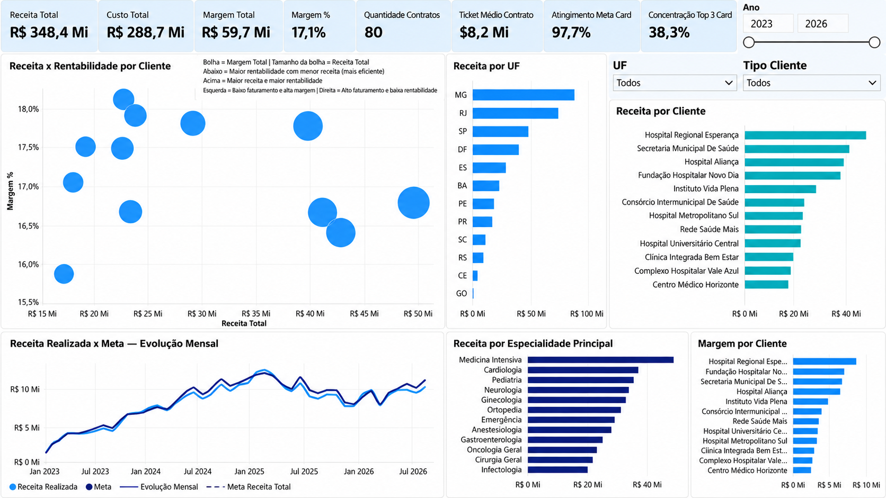

# Projeto 01 — Análise Estratégica de Contratos e Performance

## Sobre o projeto

Este projeto de Business Intelligence foi desenvolvido com uma base **100% fictícia** de uma empresa de serviços de saúde, com o objetivo de simular um cenário real de análise de contratos, desempenho operacional, qualidade dos serviços e confiabilidade dos dados.

O projeto foi construído no **Power BI**, utilizando **Power Query**, **modelagem de dados**, **DAX**, análise de KPIs e técnicas de **Data Quality**.

> Todos os nomes, clientes, valores e informações utilizados neste projeto são fictícios e foram criados exclusivamente para estudo e portfólio.

## Objetivo de negócio

Criar uma solução analítica capaz de responder perguntas como:

- Qual é o tamanho e o valor da carteira de contratos?
- Quais clientes concentram maior receita?
- Quais contratos estão próximos do vencimento?
- Quanto do valor total da carteira está exposto a vencimentos?
- Quais especialidades possuem maior volume e valor financeiro?
- Quais serviços apresentam maior criticidade?
- A operação está atingindo as metas de receita?
- Como estão SLA, satisfação, absenteísmo e incidentes?
- Os dados utilizados nas análises são confiáveis?

## Base de dados

### Contratos
Granularidade: **1 linha = 1 contrato**

Campos principais: cliente, tipo de cliente, estado, município, especialidade principal, datas de vigência, status, valor mensal, valor total e meta de margem.

### Itens_Servicos
Granularidade: **1 linha = 1 item/serviço**

Campos principais: especialidade, descrição do serviço, unidade de medida, quantidade mensal, valor unitário, valor mensal, SLA e nível de criticidade.

### Desempenho_Mensal
Granularidade: **1 linha = desempenho de um contrato em um determinado mês**

Campos principais: receita realizada, meta de receita, custo, margem, atendimentos, SLA, satisfação, incidentes e absenteísmo.

### Dim_Clientes
Tabela dimensão utilizada para classificar os clientes entre **Público** e **Privado**.

Também foi criada uma **Dim_Calendario** para permitir análises temporais e inteligência de tempo.

## Tratamento e qualidade dos dados

Antes da criação dos dashboards, foi realizado um processo de auditoria e tratamento no **Power Query**.

Principais problemas identificados:

- 4 contratos duplicados removidos
- 3 classificações de cliente recuperadas por tabela de referência
- 2 valores mensais reconstruídos por regra de negócio
- 3 registros com SLA ausente identificados
- 2 valores inválidos de incidentes corrigidos
- Padronização de textos, espaços e capitalização
- Validação de datas e prazos
- Validação de valores financeiros
- Verificação de integridade referencial entre tabelas

Ao final do processo:

- **80 contratos validados**
- **246 itens/serviços validados**
- **855 registros mensais validados**
- **100% dos registros finais aprovados nas regras de validação**

## Modelagem de dados

```text
Dim_Clientes
     1
     |
     *
 Contratos
  1      1
  |      |
  *      *
Itens   Desempenho_Mensal
            *
            |
            1
      Dim_Calendario
```

Principais relacionamentos:

- `Dim_Clientes[Cliente]` → `Contratos[Cliente]`
- `Contratos[Contrato_ID]` → `Itens_Servicos[Contrato_ID]`
- `Contratos[Contrato_ID]` → `Desempenho_Mensal[Contrato_ID]`
- `Dim_Calendario[Date]` → `Desempenho_Mensal[Mes_Referencia]`

## Principais medidas DAX

- Receita Total
- Custo Total
- Margem Total
- Margem %
- Quantidade de Contratos
- Ticket Médio por Contrato
- Atingimento da Meta %
- Concentração de Receita Top 3 Clientes
- Contratos Ativos
- Contratos Vencendo
- Contratos Encerrados
- Contratos Vencendo em 120 dias
- Valor Exposto em 120 dias
- Quantidade de Serviços
- Valor Mensal de Serviços
- Serviços de Alta Criticidade
- SLA Médio
- Total de Atendimentos
- Satisfação Média
- Total de Incidentes
- Absenteísmo Médio
- Taxa de Validação Final

## Dashboards desenvolvidos

### 1. Visão Executiva



Principais indicadores:

- Receita Total: **R$ 348,4 Mi**
- Custo Total: **R$ 288,7 Mi**
- Margem Total: **R$ 59,7 Mi**
- Margem: **17,1%**
- Quantidade de contratos: **80**
- Ticket médio por contrato: **R$ 8,2 Mi**
- Atingimento da meta: **97,7%**
- Concentração de receita nos Top 3 clientes: **38,3%**

Análises:
- Receita por cliente
- Receita por UF
- Receita por especialidade principal
- Margem por cliente
- Receita x rentabilidade por cliente
- Receita realizada x meta ao longo do tempo

### 2. Análise de Contratos


Indicadores:

- Contratos ativos: **36**
- Contratos vencendo: **8**
- Contratos encerrados: **36**
- Valor contratado total: **R$ 652 Mi**
- Valor exposto em 120 dias: **R$ 79,51 Mi**
- Percentual do valor exposto: **12,2%**

Também foi criada uma tabela de contratos críticos com:
- Data de vencimento
- Dias para vencer
- Faixa de prioridade
- Valor contratado

Classificação:
- Urgente
- Atenção
- Monitorar

### 3. Especialidades e Serviços


Indicadores:

- Serviços: **246**
- Especialidades: **12**
- Valor mensal de serviços: **R$ 36,12 Mi**
- Ticket médio por serviço: **R$ 146,84 mil**
- Serviços de alta criticidade: **86**
- SLA médio: **10,47 horas**

Análises:
- Valor mensal por especialidade
- Volume de serviços
- Alta criticidade por especialidade
- SLA médio por especialidade
- Valor mensal x criticidade

### 4. Performance e Qualidade


Indicadores:

- Margem: **17,1%**
- Absenteísmo médio: **5,0%**
- Satisfação média: **4,3 / 5**
- Atendimentos: **1,1 Mi**
- SLA médio: **92,8%**

Análises:
- Evolução mensal do SLA
- Evolução da satisfação
- Incidentes por mês
- Evolução do absenteísmo

### 5. Qualidade dos Dados


Indicadores:

- Contratos validados: **80**
- Itens validados: **246**
- Desempenhos validados: **855**
- Taxa final de validação: **100%**
- SLAs ausentes identificados: **3**
- Incidentes corrigidos: **2**

## Principais insights

- Os três maiores clientes concentram **38,3% da receita total**, indicando uma carteira com concentração relevante, mas não totalmente dependente de poucos clientes.
- **12,2% do valor contratado** está associado a contratos que vencem nos próximos 120 dias.
- A empresa atingiu **97,7% da meta de receita** no período analisado.
- O cruzamento entre receita e margem permite identificar clientes de alto faturamento, mas menor rentabilidade.
- A análise de especialidades combinando valor financeiro e criticidade ajuda a identificar áreas de maior prioridade operacional.
- A etapa de Data Quality identificou problemas que não seriam detectados apenas pela tipagem técnica das colunas.

## Ferramentas utilizadas

- Power BI
- Power Query
- DAX
- Modelagem de Dados
- Data Quality
- Excel
- Análise Exploratória de Dados
- KPIs e Indicadores Gerenciais

## Competências demonstradas

- Limpeza e transformação de dados
- Identificação de duplicidades e valores nulos
- Aplicação de regras de negócio
- Modelagem dimensional
- Relacionamentos entre tabelas
- Criação de medidas DAX
- Construção de dashboards
- Análise de indicadores financeiros e operacionais
- Data storytelling
- Qualidade e confiabilidade de dados

## Estrutura do repositório

```text
projeto-analise-contratos-performance/
│
├── README.md
├── dados/
│   └── Projeto_01_Portfolio_Dados_Ficticios.xlsx
├── imagens/
│   ├── 01_visao_executiva.png
│   ├── 02_analise_contratos.png
│   ├── 03_especialidades_servicos.png
│   ├── 04_performance_qualidade.png
│   └── 05_qualidade_dados.png
└── documentacao/
    └── dicionario_dados.md
```

## Autora

**Gyovanna Flores**

Projeto desenvolvido para estudo e portfólio na área de **Data Analytics / Business Intelligence**.
