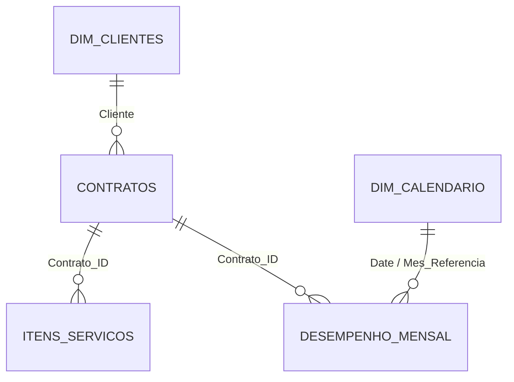

# Arquitetura do Modelo de Dados

## Objetivo da modelagem

A modelagem foi criada para permitir análises em três níveis:

- **Contrato** — visão da carteira e vigências;
- **Serviço** — visão das especialidades, valor e criticidade;
- **Mês** — visão de performance financeira e operacional.

## Tabelas do modelo

| Tabela | Tipo | Granularidade |
|---|---|---|
| Contratos | fato/dimensão central de negócio | 1 linha por contrato |
| Itens_Servicos | fato operacional | 1 linha por item/serviço |
| Desempenho_Mensal | fato mensal | 1 linha por contrato por mês |
| Dim_Clientes | dimensão | 1 linha por cliente |
| Dim_Calendario | dimensão | 1 linha por data |

## Relacionamentos

### Regras dos relacionamentos

- `Dim_Clientes[Cliente]` → `Contratos[Cliente]`
- `Contratos[Contrato_ID]` → `Itens_Servicos[Contrato_ID]`
- `Contratos[Contrato_ID]` → `Desempenho_Mensal[Contrato_ID]`
- `Dim_Calendario[Date]` → `Desempenho_Mensal[Mes_Referencia]`

Os relacionamentos foram estruturados no padrão **1:N**, evitando muitos-para-muitos desnecessários e mantendo o fluxo de filtros previsível.

## Dimensão Calendário

A `Dim_Calendario` foi criada para:

- ordenar os meses cronologicamente;
- permitir eixo temporal contínuo;
- criar atributos como ano, mês, número do mês, trimestre e mês/ano;
- preparar o modelo para análises de inteligência de tempo.

## Por que separar contratos, serviços e desempenho?

Um contrato pode possuir vários serviços e vários registros mensais de desempenho. Manter essas granularidades separadas evita duplicação de valores e permite que cada página do relatório trabalhe no nível correto.

### Exemplo

Um contrato pode ter:

- 1 registro na tabela `Contratos`;
- 3 ou mais registros em `Itens_Servicos`;
- vários registros em `Desempenho_Mensal`, um para cada mês analisado.

Essa separação é essencial para evitar somas incorretas de receita, valor contratual ou quantidade de serviços.
