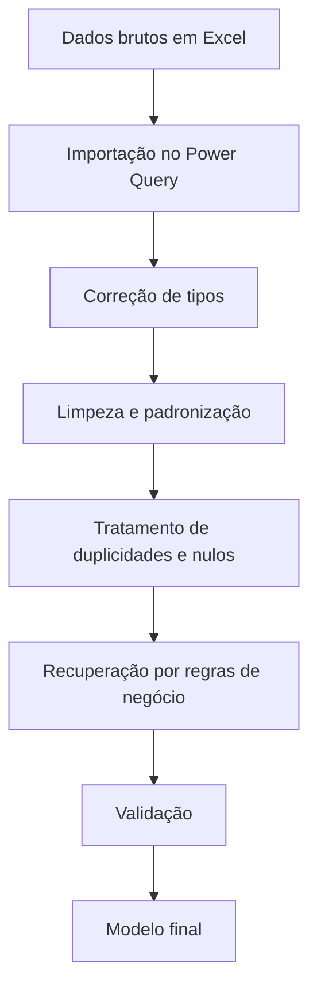

# Processo de ETL e Data Quality

## Objetivo

O processo de ETL foi criado para transformar uma base propositalmente imperfeita em um conjunto de dados confiável para análise.

A base fictícia contém inconsistências intencionais para simular situações comuns encontradas em ambientes reais.

## Fluxo

## Tratamentos aplicados

### 1. Duplicidades

Foram identificados **4 registros duplicados** na base de contratos.

A chave `Contrato_ID` foi usada como referência para garantir uma linha final por contrato.

### 2. Padronização de textos

Foram aplicadas operações como:

- remoção de espaços extras;
- padronização de capitalização;
- limpeza de textos;
- uniformização de categorias.

### 3. Classificação de clientes

Alguns contratos possuíam `Tipo_Cliente` ausente.

Foi utilizada a dimensão `Dim_Clientes` como referência para recuperar a classificação entre **Público** e **Privado**.

Resultado: **3 classificações recuperadas**.

### 4. Valores mensais ausentes

Registros com valor mensal faltante foram avaliados com base em outros campos disponíveis e regras do cenário.

Resultado: **2 valores mensais reconstruídos**.

### 5. SLA ausente

Foram identificados **3 registros sem SLA**.

Esses casos foram preservados como ausência conhecida, permitindo que a página de Data Quality evidenciasse o problema.

### 6. Incidentes inválidos

Valores incompatíveis com a regra de negócio foram tratados e convertidos em nulos controlados.

Resultado: **2 registros corrigidos**.

## Colunas de validação

Foram criadas regras de validação para contratos, itens e desempenho.

Exemplos:

- datas obrigatórias preenchidas;
- valores financeiros válidos;
- quantidade mensal maior que zero;
- SLA em faixa aceitável;
- satisfação dentro da escala esperada;
- integridade de `Contrato_ID` entre tabelas.

Os registros aprovados recebem status **OK**.

## Resultado final

| Conjunto | Registros validados |
|---|---:|
| Contratos | **80** |
| Itens/Serviços | **246** |
| Desempenho Mensal | **855** |
| Taxa final de validação | **100%** |

## Observação metodológica

Uma taxa final de 100% não significa que a base original não possuía problemas. Significa que, após o processo de tratamento, todos os registros mantidos no modelo atendem às regras de validação definidas para o projeto.
